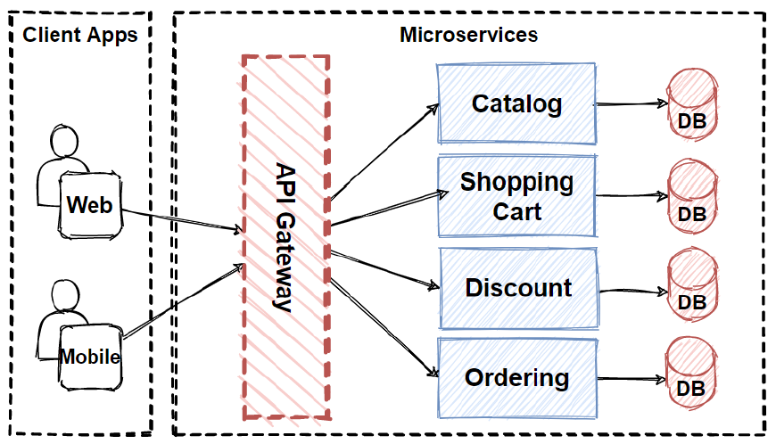

## Kong Gateway:
- It is a smart traffic controller that sits in front of your backend services.  
- Simple definition: Smart API traffic controller + security + observability + scalability

## What does Kong Gateway do?
1️⃣ API Routing
Most important purpose of Kong is API Routing. It routes incoming requests to the correct backend service.

Example:
```
/api/users   → user-service
/api/orders  → order-service
```

2️⃣ Security & Authentication
Protects APIs using:
- API Key
- JWT
- OAuth2
- OpenID Connect (OIDC)
- mTLS

Example: 
```
Client → Kong Gateway → Authentication → Backend Service
```

3️⃣ Rate Limiting & Traffic Control
Prevents abuse & overload:
- Requests per second limit
- IP restriction
- Bot detection
- Throttling

4️⃣ Load Balancing & Failover
- Distributes traffic across services
- Automatically handles service failures

5️⃣ Logging, Metrics & Monitoring
- Request logs
- Prometheus metrics
- Tracing (Jaeger, Zipkin)
- Analytics dashboards

6️⃣ Plugin-based Architecture 🧩
Kong uses plugins to extend features:
- auth
- rate limit
- caching
- logging
- security
- transformations

## 🏗 Where does Kong Gateway sit in system architecture?

```
Client
   ↓
Kong Gateway   ← security, routing, rate-limit, logging
   ↓
Microservices / Backend APIs

```
## ⚡ Why use Kong Gateway?
| Problem            | Kong Solution                  |
| ------------------ | ------------------------------ |
| Many microservices | Central routing                |
| Security           | Auth + TLS                     |
| API protection     | Rate limiting                  |
| Observability      | Metrics + logs                 |
| Scalability        | High performance (NGINX + Lua) |

## 🚀 Typical Use Cases

- Microservices gateway
- Kubernetes ingress controller
- Zero-trust security gateway
- API monetization platform
- Internal service mesh

## 🔷 High-Level Architecture
```
                        ┌─────────────┐
                        │   Clients   │
                        │ Web / Mobile│
                        └──────┬──────┘
                                │
                        ┌──────▼──────┐
                        │ CDN + WAF   │   (Cloudflare / Akamai / AWS WAF)
                        └──────┬──────┘
                                │
                    ┌─────────▼─────────┐
                    │  Load Balancer    │   (ALB / NLB / HAProxy)
                    └─────────┬─────────┘
                                │
                    ┌────────▼────────┐
                    │  Kong Gateway   │   (HA Cluster)
                    │ (Ingress + API) │
                    └────────┬────────┘
                                │
            ┌────────────────┼─────────────────┐
            │                │                 │
        ┌──────▼──────┐  ┌──────▼──────┐   ┌──────▼──────┐
        │ Auth Service│  │ Order API   │   │ Payment API │
        └─────────────┘  └─────────────┘   └─────────────┘
                                │
                        ┌───────▼────────┐
                        │ Databases      │
                        │ Cache / MQ     │
                        └────────────────┘

```
## Differences between control plan and data plane 
### Control Plane:
- Admin API
- Config
- Plugins
- Policies

### Data Plane:
- Pure traffic proxy
- Stateless
- Horizontally scalable

## 🔥 How Kong Gateway Works (Simple → Deep)
### 1️⃣ Request Lifecycle Inside Kong (Important ⭐)
```
Client
   ↓
[ SSL / TLS ]
   ↓
[ Route Match ] (Host, Path, Method, Headers, TLS)
   ↓
[ Plugins ] (Plugin Engine)
   → Auth
   → Rate Limit
   → ACL
   → Request Transform
   ↓
[ Load Balancer ] (NGINX + Lua)
   ↓
[ Backend Service ]
   ↓
[ Plugins ] (Plugin Engine)
   → Logging
   → Metrics
   → Tracing
   ↓
Client
```
### 2️⃣ Internal Architecture of Kong
                 ┌──────────────┐
                 │  Admin API   │ ← Control plane
                 └──────┬───────┘
                        │
                 ┌──────▼───────┐
                 │  Kong Core   │
                 │ (NGINX+Lua)  │
                 └──────┬───────┘
                        │
              ┌─────────▼─────────┐
              │ Upstream Services │
              └───────────────────┘
Key Technology:
- NGINX → high-performance proxy
- Lua → plugin engine
- OpenResty → NGINX + Lua framework

### 3️⃣ How Kong decides where to send traffic
Kong uses:
- Host
- Path
- Method
- Headers
- SNI (TLS)

Example: 
| Condition | Match           |
| --------- | --------------- |
| Host      | api.company.com |
| Path      | /users          |
| Method    | GET             |

### 4️⃣ Plugin Execution Model (Most important part)
- Kong executes plugins in phases (based on OpenResty + Lua pipeline execution) TODO
| Phase         | Purpose                 |
| ------------- | ----------------------- |
| rewrite       | modify request          |
| access        | auth, rate limit        |
| balancer      | upstream selection      |
| header_filter | modify response headers |
| body_filter   | modify response body    |
| log           | logging, metrics        |
### 5️⃣ DB Mode vs DB-less Mode
| Mode    | Use Case                 |
| ------- | ------------------------ |
| DB mode | Dynamic config, Admin UI |
| DB-less | GitOps, immutable infra  |

DB-less flow: 
Git → CI/CD → kong.yaml → Kong reload TODO (make example of this one)

### ⚡ Why Kong is Extremely Fast?

- Built on NGINX (event-driven, async)
- Lua plugins executed inside NGINX
- Handles 100k–1M+ RPS

## 🧠 Kong Internal Execution Flow (NGINX + Lua Deep Dive)


QUESTION:
what is kong mesh
- https://developer.konghq.com/mesh/service-mesh/
what is consumes and upstreams, snis
what is kong.conf.default file?
where is plugins directory? 
- https://developer.konghq.com/plugins/
how to write plugins
need to understand nginx.kong.conf (kong_upstream 0.0.0.1
)